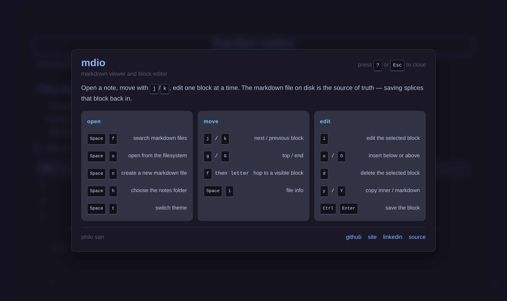
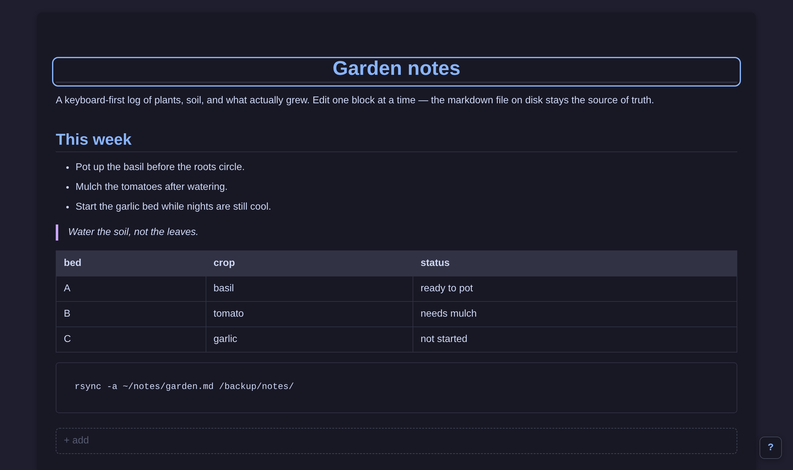
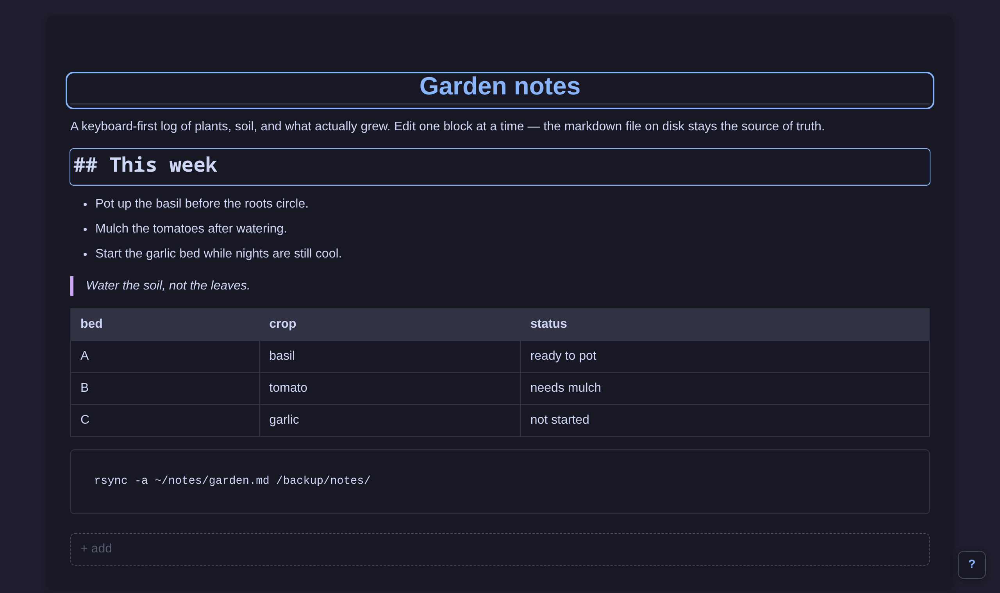
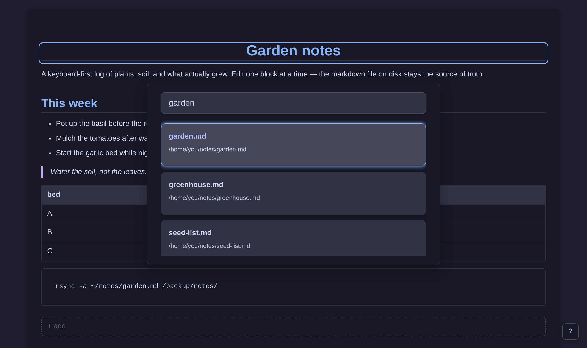
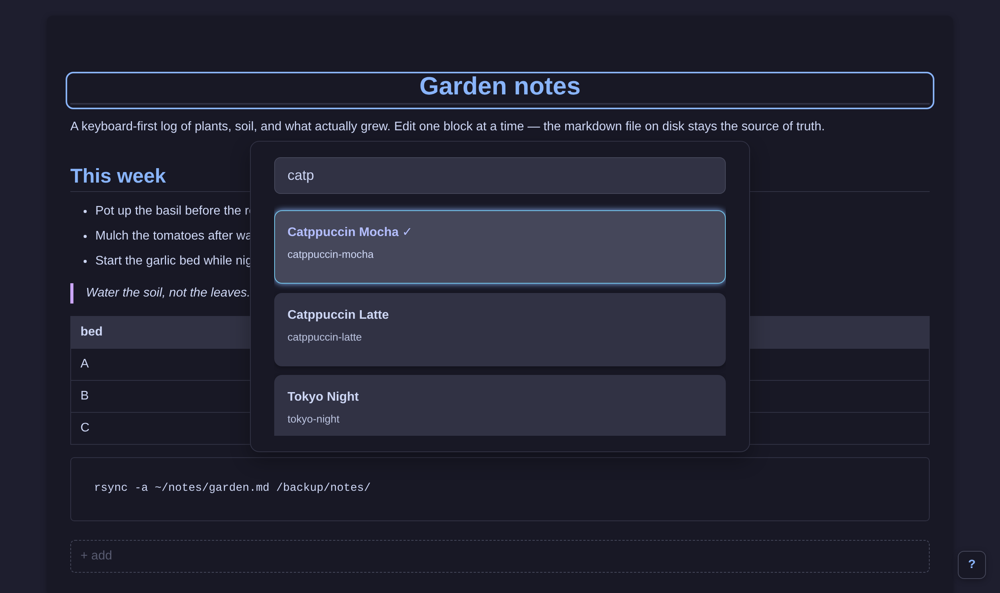
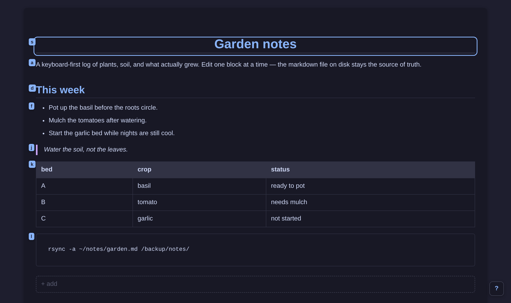
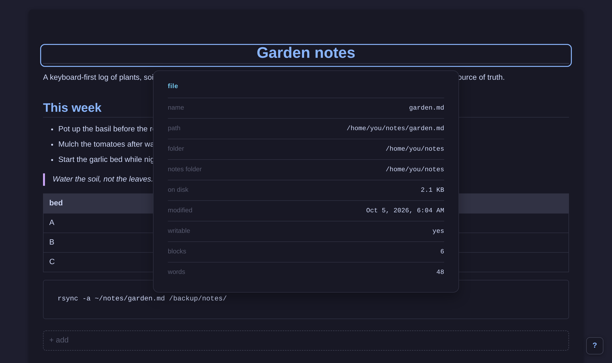

<p align="center">
  
</p>

<h1 align="center">mdio</h1>

<p align="center">
  <b>A keyboard-first markdown viewer that edits one block at a time.</b><br />
  The file on disk is the source of truth. Saving splices that block back in.
</p>

<p align="center">
  
  
  
</p>

<p align="center">
  
</p>

Open a note. Move with `j` / `k`. Hit `i` on a heading, a list, a table, a quote. Change that block. `Ctrl+Enter` writes only those bytes back to the markdown file. Live reload picks up edits from other apps. `?` is the map.

## The loop

<table>
  <tr>
    <td width="50%" valign="top">
      
      <p><b>Read.</b> An outline marks the selected block. No giant textarea, no chrome — just the note.</p>
    </td>
    <td width="50%" valign="top">
      
      <p><b>Edit.</b> One block becomes markdown. <code>Ctrl+Enter</code> saves it. <code>Esc</code> bails.</p>
    </td>
  </tr>
  <tr>
    <td width="50%" valign="top">
      
      <p><b>Find.</b> <code>Space f</code> searches your notes folder. <code>Space o</code> / <code>Ctrl+O</code> opens anything on disk.</p>
    </td>
    <td width="50%" valign="top">
      
      <p><b>Skin.</b> <code>Space t</code> filters themes. The pick lives in the app, not in the notes folder.</p>
    </td>
  </tr>
  <tr>
    <td width="50%" valign="top">
      
      <p><b>Hop.</b> <code>f</code> then a letter jumps to a visible block and starts editing.</p>
    </td>
    <td width="50%" valign="top">
      
      <p><b>Info.</b> <code>Space i</code> shows path, size, mtime, blocks, words. <code>Space h</code> picks a new notes folder.</p>
    </td>
  </tr>
</table>

## Keys

Leader is `Space`, then a letter. `?` opens this dashboard in the app.

| | |
| --- | --- |
| `Space` `f` | search markdown files |
| `Space` `o` / `Ctrl` `o` | open from the filesystem |
| `Space` `n` | new markdown file |
| `Space` `h` | choose the notes folder |
| `Space` `t` | switch theme |
| `Space` `i` | file info |
| `j` / `k` | next / previous block |
| `g` / `G` | top / end |
| `f` then letter | hop to a visible block |
| `i` / `Enter` | edit the selected block |
| `o` / `O` | insert below / above |
| `d` | delete the selected block |
| `y` / `Y` | copy inner content / copy as markdown |
| `Ctrl` `Enter` | save the block |
| `u` / `Ctrl` `z` | undo the last saved splice |
| `?` | help |

`y` on code, quotes, and tables copies the inner content. `Y` always copies the markdown.

## Install

Grab a build from [Releases](https://github.com/philopaterwaheed/mdio/releases).

| Platform | What to download |
| --- | --- |
| **Windows** | `*-setup.exe` — NSIS installer. The other `.exe` is portable (needs WebView2, already on Windows 11). |
| **Linux** | `.AppImage`, `.deb`, `.rpm`, or the unbundled `--release` binary `mdio-*-linux-x86_64` (needs WebKitGTK). |
| **macOS** | `.dmg` / `.app` (Intel and Apple Silicon) |

From source:

```bash
npm install
npx tauri icon src/assets/logo.svg
npx tauri dev
```

## How a save works

Each rendered block remembers its UTF-8 byte range in the file. Saving does not rewrite the whole note — it **splices** that range. Undo is the inverse splice, not a snapshot of the file.

The notes folder (`Space h`) is remembered in the app config, next to the OS home, not inside the notes tree. Changing home cannot lose the setting. Theme is stored separately in `localStorage`.

Default notes root is your OS home. Search indexes markdown under the notes folder you picked.
